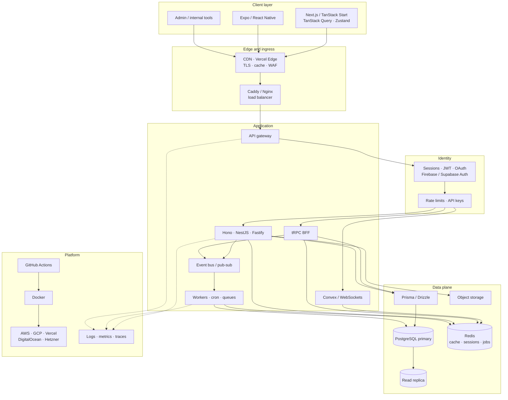

# Sushank Gurung

  

## About

<table>
  <tr>
    <td width="62%" valign="top">
      Full-stack developer at <a href="https://vbee.studio"><strong>VBEE Studio</strong></a>, based in Lalitpur, Nepal. I build scalable systems and thoughtful interfaces — event-driven backends, data-intensive apps, and UIs that feel fast and intentional.
        
      Currently focused on backend architecture, PostgreSQL optimization, and cross-platform mobile with React Native and Expo.
        
      <table>
        <tr>
          <td><strong>Role</strong></td>
          <td>Full-stack · VBEE Studio</td>
        </tr>
        <tr>
          <td><strong>Location</strong></td>
          <td>Lalitpur, Nepal</td>
        </tr>
        <tr>
          <td><strong>Learning</strong></td>
          <td>Event-driven systems, backend architecture</td>
        </tr>
        <tr>
          <td><strong>Interests</strong></td>
          <td>Data-intensive apps, podcasts, performance</td>
        </tr>
      </table>
    </td>
    <td width="38%" align="center" valign="middle">
      
    </td>
  </tr>
</table>

  

## Stack

How a product is wired end to end — clients at the edge, typed APIs in the middle, and a data plane that can take load.

| Layer | What lives here |
| --- | --- |
| **Clients** | Next.js and TanStack Start on the web, Expo on mobile, TanStack Query and Zustand for server/client state |
| **Edge** | CDN and Vercel Edge for TLS, caching, and geo routing; Caddy or Nginx as reverse proxy and load balancer |
| **Identity** | Sessions, JWT, OAuth; Firebase or Supabase Auth when a hosted identity layer is the right call |
| **APIs** | tRPC for first-party typed RPCs; Hono, NestJS, and Fastify for REST; Convex and WebSockets for realtime |
| **Async** | Redis-backed queues, cron, and a pub/sub event bus so writes can fan out without blocking the request path |
| **Data** | PostgreSQL as source of truth with a read replica; Redis for cache, sessions, and jobs; object storage for media; Prisma or Drizzle as the ORM |
| **Platform** | Dockerized services on AWS, GCP, DigitalOcean, or Hetzner; Vercel for the web surface; GitHub Actions for CI/CD |
| **Observability** | Structured logs, metrics, and traces on the gateway, APIs, and workers |

**Frontend**

**Backend**

**Data**

**Mobile, cloud, tooling**

 

  

## Analytics

  
  

  
  

  
  

  

  <picture>
    <source media="(prefers-color-scheme: dark)" srcset="https://raw.githubusercontent.com/cHANGTEEZY/cHANGTEEZY/output/github-contribution-grid-snake-dark.svg" />
    <source media="(prefers-color-scheme: light)" srcset="https://raw.githubusercontent.com/cHANGTEEZY/cHANGTEEZY/output/github-contribution-grid-snake.svg" />
    
  </picture>

  

## Freelance

I take on freelance work alongside studio projects, especially with early-stage teams on clear, high-impact problems.

Full-stack web apps · Frontend development · Cross-platform mobile · MVP builds · API design

  

  

## Reading

| Writer | Why |
|--------|-----|
| [Dan Abramov](https://overreacted.io) | Honest writing on React internals and how to think about software |
| [Josh Comeau](https://www.joshwcomeau.com) | Interactive explanations of CSS and React |
| [Dominik Dorfmeister](https://tkdodo.eu/blog) | Practical insights from the React Query maintainer |
| [Lee Robinson](https://leerob.io) | Next.js, developer experience, and product thinking |
| [Kent C. Dodds](https://kentcdodds.com/blog) | Testing philosophy and React patterns |
| [Theodorus Clarence](https://theodorusclarence.com/blog) | Production-ready TypeScript and Next.js patterns |

  

